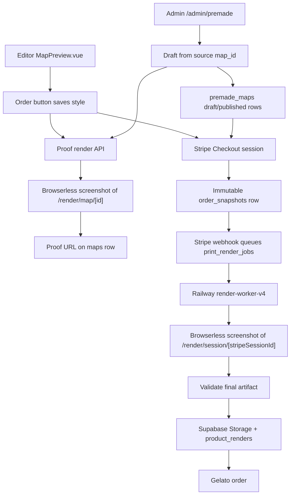

# Architecture And Security Review

**Date:** 2026-06-02
**Scope:** Browserless renderer, print queue, checkout/order flow, admin premade catalog, renderer-adjacent security.

## Summary

RadMaps now has one canonical poster renderer: `components/map/MapPreview.vue`.
Proof and final print files are Chromium screenshots of dedicated Nuxt render
pages. The old separate renderer paths have been removed or retired so editor
parity is the default behavior instead of a best-effort comparison target.

The premade shop catalog is now database-backed. Staff can create draft premades
from a source `map_id`, generate missing preview assets through the same signed
proof render path, and publish only complete rows for checkout/customization.

## Cleanup Completed

- Removed the legacy `render-worker/` Puppeteer renderer.
- Removed the native/SVG spike code and stale native render tests.
- Simplified `render-worker-v4/` to queue orchestration only: Browserless
  capture, validation, Supabase upload, `product_renders`, and Gelato submit.
- Removed legacy `RENDER_PIPELINE_V4_*` and `RENDER_WORKER_*` flags from the
  active app path and examples.
- Routed Railway to `render-worker-v4/Dockerfile.queue`.
- Removed the unsafe physical-order fallback that could send a proof thumbnail
  to Gelato when final render queue setup failed.
- Checkout now fails closed if snapshot freezing fails by expiring the open
  Stripe Checkout session.
- GPX parsing now uses maintained `@xmldom/xmldom`, rejects oversized uploads,
  and rejects `DOCTYPE`/`ENTITY` declarations before XML parsing.
- Admin and premade catalog writes now sit behind server-only Nitro APIs with
  explicit staff role checks.
- Public premade catalog APIs return only published database rows; the old
  static catalog is seed/reference fallback only while the table is missing or
  empty.
- Admin/support search no longer interpolates user input into raw PostgREST
  filter strings.
- Public order lookup no longer interpolates customer email into a raw PostgREST
  `.or()` filter; it uses exact `guest_email` and `shipping_address->>email`
  filters and deduplicates by order ID.
- Stripe Checkout session creation now records buyer identity in metadata,
  conditionally claims shipping quotes, and expires newly-created sessions when
  local setup fails after Stripe creation.
- Custom checkout now treats phone as optional consistently with the server
  schema and shows checkout-session failures inline instead of hiding server
  recovery messages behind a generic alert.
- Gelato webhook emails escape webhook-provided tracking/carrier fields and only
  render HTTP(S) tracking links.

## Current Architecture



## DRY And Organization Notes

- Print size, bleed, safe-area, DPI, and pixel dimensions must come from
  `utils/print/printFraming.ts` and `utils/print/providerProfile.ts`.
- `MapPreview.vue` owns poster composition and readiness; do not duplicate
  title/footer/border layout in workers or API routes.
- `utils/render/renderTicket.ts` is the boundary for third-party screenshot
  URLs. Do not put shared secrets directly into Browserless URLs.
- The queue worker should stay boring. It should not know how to draw a map; it
  only knows how to request, validate, upload, and submit an artifact.
- `utils/premadeCatalog.ts` owns draft defaults, asset fallback order, and
  publish validation for premade maps. Keep checkout/customization dependent on
  published database rows, not static seed data.

## Safe Changes Implemented

- Physical Stripe checkout no longer continues if the immutable snapshot fails.
- Final render queue insertion failure marks the order failed instead of using
  a proof render as the print file.
- Gelato faux E2E can use `GELATO_ORDER_TYPE=draft`; worker tests now assert
  the draft value reaches the Gelato request path.
- Final screenshot validation is isolated in
  `render-worker-v4/src/queue/validateBrowserScreenshot.ts` with unit tests.
- Dead renderer dependencies were removed from the worker package, reducing
  container size and attack surface.
- Removed the unused `ai` package and upgraded test tooling so `npm audit`
  reports zero known vulnerabilities for the app and worker.
- `anthonynmaro@gmail.com` is configured as a protected super-admin locally and
  in production. Super-admin rows are upserted as active `admin` users and
  cannot be demoted from the staff UI.

## Remaining Risks

- **Admin audit trail:** `created_by`/`updated_by` capture who changed staff and
  premade rows, but there is no append-only audit event table yet. Add one
  before scaling admin access beyond a small trusted team.
- **Gelato submission reconciliation:** Stripe webhook deduplication is durable
  and retryable failures release the event marker, but Gelato's public create
  order docs do not document an idempotency header. If Gelato order creation
  succeeds and the worker fails before saving `gelato_order_id`, an operator
  may need to reconcile by `orderReferenceId` before retrying fulfillment.
- **Render capacity:** `/api/maps/[id]/render` now has per-user rate limits, but
  proof renders still run outside the final print queue. Keep monitoring
  Browserless concurrency and cost as traffic grows.
- **User image trust boundary:** Browserless can fetch any URL the render page
  references. Uploaded logos and future image overlays should be copied to
  trusted storage or restricted to an allowlist before render.
- **Legacy DB artifacts:** The `render_cache` table remains in historical
  migrations/schema. It is no longer used by app code and can be dropped in a
  migration after confirming there are no production readers.
- **Fulfillment observability:** Queue failures reach `manual_review`, but
  operator-facing alerting is still light. Add explicit alerts for repeated
  Browserless failures, Gelato submission failures, and missing snapshots.
- **Physical print validation:** Browser screenshots look good locally, but
  production should still require sample prints for `16x24`, `24x36`, and
  `32x48` before raising traffic.
- **Dependency drift:** `npm audit` is clean as of this review. Keep it in CI so
  dev-tool and XML/parser advisories do not quietly return.

## E2E Trial Requirements

Use faux fulfillment until you intentionally submit a real order:

- Stripe keys must be test mode: `sk_test_*` and `pk_test_*`.
- Stripe CLI should forward webhooks to
  `http://localhost:3001/api/orders/webhook`.
- `GELATO_ORDER_TYPE=draft` must be set for the app and worker.
- `NUXT_PUBLIC_SITE_URL` and worker `APP_URL` must point to the same public
  ngrok URL.
- Browserless, Supabase, Render Ticket, Gelato, and Resend env vars must be
  present in the app and worker environments as documented in
  `docs/RENDERING.md`.

Run:

```bash
npm run e2e:readiness
npm run dev
npm run print-worker:dev
stripe listen --forward-to http://localhost:3001/api/orders/webhook
```

Then complete Stripe Checkout with card `4242 4242 4242 4242`.
