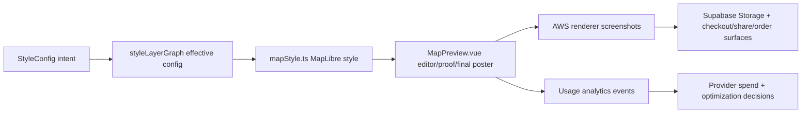
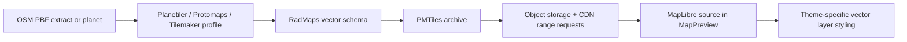
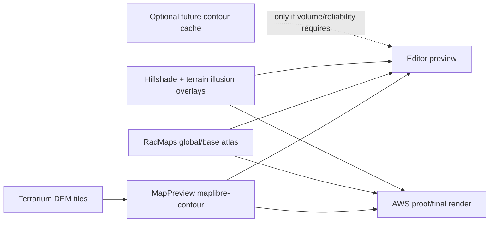
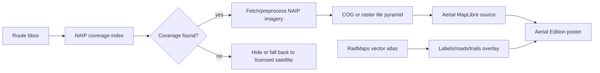

# RadMaps Map Tools Catalog

This is the operating ledger for RadMaps map sources, tile services, generated layers, attribution, and usage accounting. Update it whenever `types/index.ts`, `utils/mapStyle.ts`, `utils/styleLayerGraph.ts`, `components/map/StylePanel.vue`, render-worker behavior, provider contracts, attribution placement, or analytics dimensions change.

The admin reference page mirrors this taxonomy at `/admin/map-tools`.

## Update Convention

- Treat `StyleConfig.preset`, `StyleConfig.base_tile_style`, style graph `sources`, provider IDs, and analytics dimensions as public internal names. Do not rename them casually.
- When adding or changing a map source, update this file and `utils/mapToolCatalog.ts` in the same change set.
- If the change affects visible layer support, update `utils/styleLayerGraph.ts` first, then this catalog.
- If the change affects proof/final screenshots, also update `docs/RENDERING.md`.
- If the change affects attribution, licensing, commercial print rights, or provider data lineage, add the provider/source URL and the exact display text we intend to show.
- If the change adds a database table for usage accounting, include forward and rollback migrations in the same PR.

## Current Render Flow



## Inventory

| System | App names | Status | Cost model | What it provides | Main styling attributes | Attribution / license posture |
|---|---|---:|---|---|---|---|
| CARTO Basemaps | `carto-light`, `carto-dark`, `Minimalist` | Active | Enterprise | Retina raster base tiles with baked roads, water, labels, and landuse | `base_tile_style`, `tile_effect`, `tile_contrast`, `tile_saturation`, `tile_hue_rotate`, `tile_grain` | Requires CARTO and OpenStreetMap attribution; commercial basemap use requires CARTO Enterprise terms. |
| Mapbox Maps/Streets/Fonts | `topographic`, Mapbox Outdoors, Mapbox Streets overlay | Active | Usage-based | Raster topographic tiles, vector roads/water/labels/POIs, glyphs | `show_roads`, `roads_color`, `water_color`, `show_place_labels`, `show_poi_labels` | Requires Mapbox and OpenStreetMap attribution; satellite would add imagery credits such as Maxar where applicable. |
| MapTiler Raster Styles | `maptiler-outdoor`, `maptiler-topo`, `maptiler-winter`, `alidade-smooth`, `alidade-smooth-dark` | Active | Paid/custom | Baked raster outdoor/topo/winter/dataviz styles | `base_tile_style`, `tile_effect`, `tile_contrast`, `tile_saturation`, `tile_hue_rotate` | Requires MapTiler and OpenStreetMap attribution unless written terms and non-OSM data remove parts of it. |
| Stadia/Stamen | `stadia-watercolor`, `stadia-toner` | Active | Paid/commercial license | Legacy provider-backed Watercolor and Toner raster art; Toner label-family toggle remains for comparison and saved maps | `show_place_labels`, `tile_effect`, `tile_contrast`, `tile_saturation`, `tile_hue_rotate` | Requires Stadia, Stamen, and source-data attribution; commercial use requires Stadia licensing. |
| AWS Terrain Tiles / Mapzen DEM | `mapbox-dem` source name, browser contour DEM, hillshade DEM | Active | Free public source | Terrarium DEM tiles for hillshade, browser contours, terrain exaggeration | `show_hillshade`, `hillshade_intensity`, `show_contours`, `contour_detail`, `map_3d`, `terrain_exaggeration` | Requires Mapzen/OpenStreetMap attribution where derived terrain layers are visible. |
| RadMaps Open Vector Atlas | `radmaps-vector`, `radmaps-roads`, `radmaps-water`, `radmaps-labels`, `radmaps-toner-light`, `radmaps-toner-dark`, Atlas Lab house styles including `Toner Light`, `Toner Dark`, and `RadMaps Contour Wash` | Beta | Self-hosted | Production R2 PMTiles base atlas for contiguous U.S., North America, New Zealand, Northern Spain/Camino, Mount Fuji/Japan, and Patagonia Andes, plus the Driftless lab pack; hosted tile contract at `tiles.radmaps.studio`; water, waterways, transportation/roads, basic trails/paths, named outdoor-route overlays, labels, base POIs plus additive Overture POI overlays, buildings, landuse, parks/forests; first-party light/dark Toner presets with high-contrast road linework and soft dot patterns for named protected park areas. | Full vector paint/layout control for layer families; `poi` remains the manifest key for Overture Places overlays, while `outdoorRoutes` carries named OSM hiking/bicycle/MTB route relations. | OSM attribution remains unless source data is non-OSM or attribution-free; Overture overlays require Overture attribution/data-lineage review before promotion. |
| RadMaps Watercolor Art Tile Renderer | `/api/watercolor/tiles/base`, `radmaps-watercolor` | Beta | Self-hosted server PNG art tiles with MapLibre tile/readiness tracking | Same-origin Atlas MVT tiles converted into deterministic 1024px `scale=2` watercolor raster art tiles displayed as 512px MapLibre tiles: filled water/park washes, brush-painted roads/trails/waterways, sketched boundaries/buildings, world-aligned first-party paper/pigment/drybrush textures, and crisp vector labels/route above. Legacy `radmaps-watercolor-*` ids are hidden aliases for saved maps. | `watercolor_seed`, canonical recipe, `atlas_layers`, `atlas_layer_settings`, `water_color`, `land_color`, `roads_color`, `show_roads` | Inherits RadMaps Atlas/OpenStreetMap attribution. Does not ship Stamen/Stadia watercolor raster assets. |
| RadMaps Terrain Runtime | `radmaps-terrain`, browser-generated `contours`, `radmaps-hillshade`, `RadMaps Simple Contour` | Beta | Browser/AWS renderer compute first; self-hosted cache later only if needed | Atlas styles now prefer generated `maplibre-contour` output from Terrarium DEM in both editor and AWS-rendered proof/final output. Existing R2 contour PMTiles remain QA/history/coverage experiments, not the global production default. | `show_contours`, `contour_detail`, `contour_*`, `show_hillshade`, `hillshade_intensity`, `terrain_exaggeration`, Atlas style ids | Requires Mapzen/OpenStreetMap attribution where derived terrain layers are visible. Cached/self-hosted terrain artifacts must carry source DEM metadata. |
| NAIP Aerial Imagery | `naip-aerial-us`, `Aerial Edition USA` | Candidate | Self-hosted | 0.6m to 1m public-domain US aerial imagery, natural color and potential false-color variants | `imagery_opacity`, `imagery_saturation`, `imagery_contrast`, `imagery_tint`, vector overlay attributes | Public domain, but credit USDA/USGS/NAIP for product clarity and data lineage. |

## Layer Capability Accounting

Current owned-atlas coverage accounting:

| Environment | Base coverage | Terrain/contour coverage | Customer status |
|---|---|---|---|
| `staging` | Contiguous U.S., North America, New Zealand, Northern Spain/Camino, Mount Fuji/Japan, and Patagonia Andes base artifacts in R2. Main artifact ids: `radmaps-us-base`, `radmaps-north-america-base`, `radmaps-new-zealand-outdoor-base`, `radmaps-northern-spain-camino-base`, `radmaps-mount-fuji-japan-base`, `radmaps-patagonia-andes-base`. | `177` `us-terrain-phase1` contour shards retained for QA/cache experiments; default strategy is browser-rendered contours. | Hosted at `tiles.radmaps.studio` through the Cloudflare Worker custom domain and verified at `radmaps-atlas-tiles.radmaps-atlas.workers.dev`; the Vercel shim remains as fallback during DNS cache transition. |
| `production` | Driftless, contiguous U.S., North America, New Zealand, Northern Spain/Camino, Mount Fuji/Japan, and Patagonia Andes base artifacts in R2. | Driftless contour artifact only, plus editor/AWS renderer runtime contour generation. | Active approved coverage manifest `2026.05.27-approved-coverage.1`; broad customer access still gated by `radmaps_atlas_editor`. |

The next production step is not more precomputed terrain. It is to keep
production QA tight across the approved coverage, add z16 `poi` and
`outdoorRoutes` hotspot overlays, then decide whether wider Honshu/Japan or
larger Europe/global packs justify the runner/source cost.
High-detail contours remain runtime-generated through `maplibre-contour` unless usage or
reliability makes a regional cache worthwhile. Do not wire Mapbox Terrain v2 or
R2 contour PMTiles into the customer editor, proof, checkout, or final render
path as an implicit fallback; keep cached contours in Admin Atlas Lab/QA until a
separate render-data decision promotes them.

Use these categories when documenting each preset or provider:

- `editable-vector`: RadMaps can style geometry independently. Examples: Mapbox Streets road lines in `road-network`, future RadMaps vector water.
- `baked-raster`: The feature is part of the image tile. We can recolor the whole raster, but not individual roads, water, labels, or POIs.
- `required`: The preset always consumes the layer or field. Example: `contour-art` requires contours.
- `unsupported`: The preset should hide the control and preserve saved intent without rendering it.

Canonical layer order remains:

`background -> base -> water-land-buildings -> terrain -> contours -> editable-roads -> route-casing -> route -> labels-pois -> segments-handles`

Route linework should render below map labels by default so labels stay readable. Interactive segment handles and editing overlays are the exception and stay above labels.

## Analytics Convention

RadMaps needs provider accounting at the same level of care as payment accounting. The target event stream should answer:

- Which providers and tile styles are users previewing?
- Which providers and tile styles lead to checkout and paid final renders?
- Which proof renders are churned repeatedly without conversion?
- Which paid source should be replaced first by RadMaps-owned atlas work?
- Which atlas versions are in active orders if a tile build has to be rolled back?

Recommended event points:

| Event | When | Required dimensions |
|---|---|---|
| `map_style_selected` | User selects preset or base tile style | `map_id`, `user_id`, `preset`, `base_tile_style`, `provider_ids`, `enabled_layers` |
| `map_proof_render_requested` | Proof render API is called | `map_id`, `user_id`, `render_class=proof`, `preset`, `base_tile_style`, `provider_ids`, `tile_effect`, `print_size` |
| `checkout_proof_render_requested` | Product-specific proof starts | `map_id`, `user_id`, `product_uid`, `print_size`, `provider_ids`, `preset` |
| `map_final_render_started` | Queue worker starts paid final render | `map_id`, `stripe_session_id`, `render_class=final`, `product_uid`, `provider_ids`, `atlas_version`, `tile_schema_version` |
| `map_final_render_completed` | Final render uploaded | Previous dimensions plus `duration_ms`, `pixel_width`, `pixel_height`, `tile_warning_count` |
| `map_public_share_rendered` | Share flow forces latest proof | `map_id`, `user_id`, `preset`, `provider_ids`, `proof_age_seconds` |

Atlas watercolor events should also include `watercolor_renderer_version`,
`watercolor_texture_pack_version`, `watercolor_recipe_id`, `watercolor_seed_present`,
`watercolor_tile_count`, and `watercolor_tile_render_ms_p95` once provider usage
tracking is persisted.

Toner light/dark choice is represented by `preset` (`radmaps-toner-light` or `radmaps-toner-dark`); no separate Toner variant dimension is needed for new selections.

Candidate DB table, when we decide to implement this:

```sql
create table map_provider_usage_events (
  id uuid primary key default gen_random_uuid(),
  created_at timestamptz not null default now(),
  event_name text not null,
  user_id uuid,
  map_id uuid,
  provider_ids text[] not null default '{}',
  preset text,
  base_tile_style text,
  render_class text,
  print_size text,
  product_uid text,
  atlas_version text,
  tile_schema_version text,
  dimensions jsonb not null default '{}'::jsonb
);

create index map_provider_usage_events_created_at_idx on map_provider_usage_events (created_at desc);
create index map_provider_usage_events_map_id_idx on map_provider_usage_events (map_id, created_at desc);
create index map_provider_usage_events_provider_ids_idx on map_provider_usage_events using gin (provider_ids);
```

Any migration for this table needs a paired rollback script per the project database policy.

## Strategic Track 3: Self-Hosted OSM Vector Atlas

Goal: replace Mapbox Streets and most baked raster dependencies with a RadMaps-controlled vector atlas for roads, water, buildings, landuse, trails, place labels, POIs, and park/forest geometry.

Recommended architecture:



Why this is attractive:

- PMTiles is designed as a single-file tile archive that can live on static object storage and be read by HTTP range requests.
- Atlas Lab resolves approved PMTiles artifacts from the active Atlas manifest. When `NUXT_PUBLIC_RADMAPS_ATLAS_TILE_BASE_URL` is configured it prefers the hosted tile route `/tiles/{environment}/{artifactId}/{z}/{x}/{y}.mvt`; otherwise local/admin development uses the same-origin `/api/atlas/tiles/{base|terrain|poi|outdoorRoutes}/{z}/{x}/{y}.mvt` fallback. `tiles.radmaps.studio` is served by the Cloudflare Worker custom domain backed by R2 manifests, with the Vercel shim retained as fallback during DNS cache transition. Production traffic should not use caller-supplied raw tile URLs.
- Planetiler can generate planet-scale vector tiles from OSM and other geographic sources without a PostGIS tile stack.
- Tilemaker is simpler for local/regional experiments and lets us author Lua profiles for exactly the layer schema we want.
- Vector layers let themes blend water, roads, labels, POIs, landcover, and buildings separately instead of pushing color transforms over baked rasters.
- The `radmaps-toner-light` and `radmaps-toner-dark` presets recreate the Toner look with Atlas vectors and generated dot-pattern fills only on named protected park/preserve polygons. The legacy `radmaps-toner` alias remains renderable for saved maps, and `stadia-toner` remains available as the legacy/provider-backed raster comparison.
- The Atlas watercolor preset consumes the same base MVT tiles through the
  server `/api/watercolor/tiles/base/{z}/{x}/{y}.png` art-tile renderer. It
  emits 1024px `scale=2` PNG tiles displayed as 512px MapLibre raster tiles,
  preserves feature geometry for brush-painted roads, sketched
  buildings/boundaries, and filled water/park washes, and keeps labels, POIs,
  route collision, and the GPX route as vector layers above it.
- Coverage expansion targets live in `atlas/coverage-targets.json` v2. North
  America is the promote-first path; New Zealand, Northern Spain/Camino,
  Mount Fuji/Japan, and Patagonia Andes are live low-cost global proof packs.
  The matrix enforces a `$200` total build budget, dry-run cost logging,
  z16 `poi`/`outdoorRoutes` overlays, and 24x36 print QA before rollout.
  Larger hotspots such as Alps/Dolomites and Himalaya stay deferred until
  source-size, demand, DEM quality, and budget gates clear.

Proposed build stages:

1. **Regional proof of concept:** Generate a PMTiles archive for one trail-heavy region. Add a dev-only `radmaps-vector` source and one hidden preset.
2. **Schema contract:** Define required layers: `water`, `waterway`, `road`, `trail`, `landuse`, `building`, `place_label`, `poi`, `park`, `boundary`.
3. **Style graph integration:** Add graph sources and feature support for editable vector water/roads/labels/POIs.
4. **Visual regression:** Use the existing style browser fixture to compare vendor and RadMaps atlas output across representative routes.
5. **Promotion model:** Publish immutable `atlas_version` archives and a stable alias after checks pass.

Open questions:

- Do we start from Protomaps Basemap layers, OpenMapTiles-compatible output, or a RadMaps-native schema?
- How much OSM tag richness do we need for trails and park POIs?
- Should the editor fetch PMTiles directly, or should the AWS renderer use a tile proxy for caching and observability? Current Atlas Lab behavior favors the tile endpoint because it made road/POI debugging and future Worker deployment cleaner.

## Strategic Track 4: RadMaps Terrain Atlas

Goal: build a print-first terrain system: contours, hillshade, hydro emphasis, slope/aspect texture, landcover masks, and terrain-aware label density. This should become a house style, not a generic web topo layer.

Recommended architecture after the 2026-05 browser-rendered contour pivot:



Automation ideas:

- Generate contour intervals by target print scale, not just web zoom, using the existing `contour_detail` thresholds as the fidelity benchmark.
- Build multiple hillshade recipes: soft editorial, dramatic mountain, dark-mode relief, blueprint relief.
- Add slope/aspect, hachure, watercolor wash, paper grain, and ghost-contour treatments as runtime/renderer effects before paying to precompute global terrain.
- Run AWS renderer readiness checks that wait for contour/DEM source completion before final render jobs submit to Gelato.
- Store `dem_source`, `contour_detail`, `contour_interval`, `hillshade_style`, and whether the AWS renderer timed out waiting for terrain in render metadata.

Current live terrain packs:

| Region | Object | Notes |
|---|---|---|
| Driftless | `atlas/v1/terrain/driftless/2026-05-15/radmaps-driftless-contours.pmtiles` | Original contour proving pack used as the local/default fallback. |
| `us-terrain-phase1` | 177 shard artifacts in `public/atlas/manifests/staging.json` | Verified staging coverage for Yosemite/Sierra, Rocky Mountain/Front Range, Smokies/Appalachia, Moab/Canyonlands, Seattle/Cascades, and Acadia via route-bbox artifact resolution. |
| `us-terrain-backbone` | 136 shard artifacts from the 2026-05-18 build | Successful broader terrain run; sync into manifests as needed for additional staging coverage. |
| Yosemite / Rocky / Smokies / North Shore legacy packs | 2026-05-17 single-region objects | Older showcase proving packs retained for fallback/history, no longer the primary Atlas Lab coverage model. |

Terrain build config now lives in `atlas/terrain-regions.json`. It defines named contour regions and packs so we can run the same build system for local showcase packs, Midwest coverage, and then US/global coverage. Use:

```bash
npm run atlas:terrain-plan -- --pack midwest-core
npm run atlas:build-contours -- --region midwest-driftless-expanded --output atlas/build/terrain/midwest-driftless-expanded/radmaps-midwest-driftless-expanded-contours.pmtiles
```

Current build packs:

| Pack | Regions | Purpose |
|---|---:|---|
| `all-showcase` | 5 | Rebuild the live Atlas Lab contour showcase regions. |
| `midwest-core` | 5 | First serious low-relief production pack: Driftless, Superior/Northwoods, Chicago/Lake Michigan, West Michigan, Ohio/Indiana. |
| `us-terrain-backbone` | 6 | Mountain/coastal priority regions for US product coverage outside the Midwest. |
| `us-terrain-phase1` | 9 | Midwest plus US backbone regions; first broad national contour push before full contiguous-US tiling. |

Density targets:

- Midwest/lowland: 10-20 ft minor contours, 50-100 ft index contours, 250-500 ft major contours.
- Mountain/canyon: 40 ft minor contours, 200 ft index contours, 1000 ft major contours.
- All contour vector features carry `elevation_ft`, `elevation_m`, `interval_class`, `contour_interval_ft`, `index_interval_ft`, `major_interval_ft`, `source_dem`, `terrain_zone`, and `terrain_atlas_version`.

Why this changed:

- High-detail global precomputed contour PMTiles are too expensive for the current business stage.
- Current browser contours can be denser than the owned PMTiles contour shards because `maplibre-contour` can generate intervals directly from DEM thresholds at render time.
- The global owned atlas should focus first on base data: roads, water, labels, parks, POIs, buildings, landcover, and boundaries.
- Terrain richness should come from generated contours plus hillshade/slope/wash/hachure/grain effects. Build a contour cache only if AWS renderer reliability, DEM availability, or order volume proves we need it.

Open questions:

- Which DEM source is best by region: public-domain USGS 3DEP in the US, Copernicus DEM globally, or a hybrid?
- Do we generate contour labels as vector tile attributes or as a separate label placement layer?
- How do we version terrain when source DEMs update?

## Strategic Track 5: NAIP Aerial Edition USA

Goal: offer a premium aerial poster style for US routes using public-domain NAIP imagery, with RadMaps-owned vector labels and route overlays on top.

Recommended architecture:



Automation ideas:

- Maintain a NAIP coverage index by state, year, resolution, and route bbox.
- Preprocess imagery into Web Mercator COGs or raster tiles only for demanded regions at first.
- Add muted, high-contrast, infrared-inspired, and duotone aerial treatments.
- Pair aerial imagery with RadMaps vector labels so the image remains inspectable but still reads as a designed poster.
- Track imagery year and state in analytics so we know where demand justifies preprocessing.

Why this matters:

- Google is a poor fit for retail posters, while Bing/Esri/Maxar/Planet usually push us into negotiated commercial terms.
- NAIP is high-resolution US aerial imagery and USGS marks the source as public domain.
- It gives RadMaps a real satellite-like option with much more control and far less licensing fragility for US trails.

Limitations:

- NAIP is not global.
- It is aerial imagery, not satellite imagery.
- It is often leaf-on and state/year-dependent, which is beautiful for many trail posters but not always the freshest possible image.
- Production use needs preprocessing and caching; relying on public image services during AWS final renders would be brittle.

## Source Notes

- Tilemaker describes itself as a single executable that turns OSM data into vector tiles with no database stack and no commercial-use restriction: https://tilemaker.org/
- Protomaps documents PMTiles as a single archive format accessible through HTTP range requests and provides OSM basemap tooling: https://docs.protomaps.com/
- Planetiler is a flexible tool for generating planet-scale vector tiles from OSM PBFs and other geographic sources: https://wiki.openstreetmap.org/wiki/Planetiler
- USGS describes NAIP as public-domain aerial imagery for the conterminous United States: https://www.usgs.gov/centers/eros/science/usgs-eros-archive-aerial-photography-national-agriculture-imagery-program-naip
- Mapbox attribution requirements for maps and print: https://docs.mapbox.com/help/dive-deeper/attribution/
- MapTiler attribution removal rules: https://docs.maptiler.com/guides/map-design/attribution/remove-attribution/
- Stadia print attribution and commercial licensing notes: https://docs.stadiamaps.com/attribution/
- OpenStreetMap copyright and attribution baseline: https://www.openstreetmap.org/copyright
