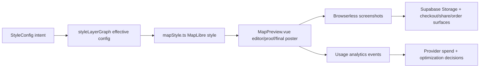
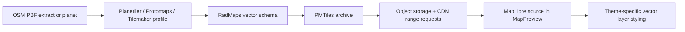
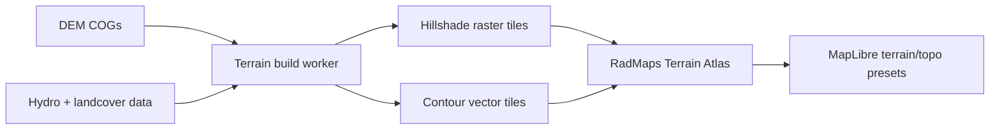
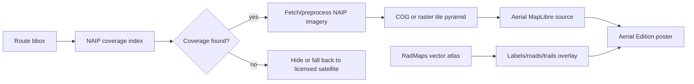

# RadMaps Map Tools Catalog

This is the operating ledger for RadMaps map sources, tile services, generated layers, attribution, and usage accounting. Update it whenever `types/index.ts`, `utils/mapStyle.ts`, `utils/styleLayerGraph.ts`, `components/map/StylePanel.vue`, render-worker behavior, provider contracts, attribution placement, or analytics dimensions change.

The admin reference page mirrors this taxonomy at `/admin/map-tools`.

## Update Convention

- Treat `StyleConfig.preset`, `StyleConfig.base_tile_style`, style graph `sources`, provider IDs, and analytics dimensions as public internal names. Do not rename them casually.
- When adding or changing a map source, update this file and `utils/mapToolCatalog.ts` in the same change set.
- If the change affects visible layer support, update `utils/styleLayerGraph.ts` first, then this catalog.
- If the change affects proof/final screenshots, also update `docs/RENDERING.md`.
- If the change affects attribution, licensing, commercial print rights, or provider data lineage, add the provider/source URL and the exact display text we intend to show.
- If the change adds a database table for usage accounting, include forward and rollback migrations in the same PR.

## Current Render Flow



## Inventory

| System | App names | Status | Cost model | What it provides | Main styling attributes | Attribution / license posture |
|---|---|---:|---|---|---|---|
| CARTO Basemaps | `carto-light`, `carto-dark`, `Minimalist` | Active | Enterprise | Retina raster base tiles with baked roads, water, labels, and landuse | `base_tile_style`, `tile_effect`, `tile_contrast`, `tile_saturation`, `tile_hue_rotate`, `tile_grain` | Requires CARTO and OpenStreetMap attribution; commercial basemap use requires CARTO Enterprise terms. |
| Mapbox Maps/Streets/Terrain/Fonts | `topographic`, Mapbox Outdoors, Mapbox Streets overlay, Terrain v2 fallback | Active | Usage-based | Raster topographic tiles, vector roads/water/labels/POIs, contour fallback, glyphs | `show_roads`, `roads_color`, `water_color`, `show_place_labels`, `show_poi_labels`, `contour_*`, `show_hillshade` | Requires Mapbox and OpenStreetMap attribution; satellite would add imagery credits such as Maxar where applicable. |
| MapTiler Raster Styles | `maptiler-outdoor`, `maptiler-topo`, `maptiler-winter`, `alidade-smooth`, `alidade-smooth-dark` | Active | Paid/custom | Baked raster outdoor/topo/winter/dataviz styles | `base_tile_style`, `tile_effect`, `tile_contrast`, `tile_saturation`, `tile_hue_rotate` | Requires MapTiler and OpenStreetMap attribution unless written terms and non-OSM data remove parts of it. |
| Stadia/Stamen | `stadia-watercolor`, `stadia-toner` | Active | Paid/commercial license | Watercolor and toner raster art; toner label-family toggle | `show_place_labels`, `tile_effect`, `tile_contrast`, `tile_saturation`, `tile_hue_rotate` | Requires Stadia, Stamen, and source-data attribution; commercial use requires Stadia licensing. |
| AWS Terrain Tiles / Mapzen DEM | `mapbox-dem` source name, browser contour DEM, hillshade DEM | Active | Free public source | Terrarium DEM tiles for hillshade, browser contours, terrain exaggeration | `show_hillshade`, `hillshade_intensity`, `show_contours`, `contour_detail`, `map_3d`, `terrain_exaggeration` | Requires Mapzen/OpenStreetMap attribution where derived terrain layers are visible. |
| RadMaps Open Vector Atlas | `radmaps-vector`, `radmaps-roads`, `radmaps-water`, `radmaps-labels`, Atlas Lab house styles | Beta | Self-hosted | Water, waterways, roads, trails, labels, POIs, buildings, landuse, parks/forests | Full vector paint/layout control for layer families | OSM attribution remains unless source data is non-OSM or attribution-free. |
| RadMaps Terrain Atlas | `radmaps-terrain`, `radmaps-contours`, `radmaps-hillshade`, `radmaps-landcover`, `RadMaps Simple Contour` | Beta | Self-hosted | Contours now; hillshade, slope/aspect textures, hydro emphasis, landcover masks next | `atlas_manifest_id`, `atlas_style_id`, `atlas_layers`, `atlas_layer_settings`, `contour_*`, `hillshade_*`, `terrain_exaggeration` | Depends on selected DEM and landcover sources; prefer public-domain or permissive sources. |
| NAIP Aerial Imagery | `naip-aerial-us`, `Aerial Edition USA` | Candidate | Self-hosted | 0.6m to 1m public-domain US aerial imagery, natural color and potential false-color variants | `imagery_opacity`, `imagery_saturation`, `imagery_contrast`, `imagery_tint`, vector overlay attributes | Public domain, but credit USDA/USGS/NAIP for product clarity and data lineage. |

## Layer Capability Accounting

Use these categories when documenting each preset or provider:

- `editable-vector`: RadMaps can style geometry independently. Examples: Mapbox Streets road lines in `road-network`, future RadMaps vector water.
- `baked-raster`: The feature is part of the image tile. We can recolor the whole raster, but not individual roads, water, labels, or POIs.
- `required`: The preset always consumes the layer or field. Example: `contour-art` requires contours.
- `unsupported`: The preset should hide the control and preserve saved intent without rendering it.

Canonical layer order remains:

`background -> base -> water-land-buildings -> terrain -> contours -> editable-roads -> labels-pois -> route-casing -> route -> segments-handles`

## Analytics Convention

RadMaps needs provider accounting at the same level of care as payment accounting. The target event stream should answer:

- Which providers and tile styles are users previewing?
- Which providers and tile styles lead to checkout and paid final renders?
- Which proof renders are churned repeatedly without conversion?
- Which paid source should be replaced first by RadMaps-owned atlas work?
- Which atlas versions are in active orders if a tile build has to be rolled back?

Recommended event points:

| Event | When | Required dimensions |
|---|---|---|
| `map_style_selected` | User selects preset or base tile style | `map_id`, `user_id`, `preset`, `base_tile_style`, `provider_ids`, `enabled_layers` |
| `map_proof_render_requested` | Proof render API is called | `map_id`, `user_id`, `render_class=proof`, `preset`, `base_tile_style`, `provider_ids`, `tile_effect`, `print_size` |
| `checkout_proof_render_requested` | Product-specific proof starts | `map_id`, `user_id`, `product_uid`, `print_size`, `provider_ids`, `preset` |
| `map_final_render_started` | Queue worker starts paid final render | `map_id`, `stripe_session_id`, `render_class=final`, `product_uid`, `provider_ids`, `atlas_version`, `tile_schema_version` |
| `map_final_render_completed` | Final render uploaded | Previous dimensions plus `duration_ms`, `pixel_width`, `pixel_height`, `tile_warning_count` |
| `map_public_share_rendered` | Share flow forces latest proof | `map_id`, `user_id`, `preset`, `provider_ids`, `proof_age_seconds` |

Candidate DB table, when we decide to implement this:

```sql
create table map_provider_usage_events (
  id uuid primary key default gen_random_uuid(),
  created_at timestamptz not null default now(),
  event_name text not null,
  user_id uuid,
  map_id uuid,
  provider_ids text[] not null default '{}',
  preset text,
  base_tile_style text,
  render_class text,
  print_size text,
  product_uid text,
  atlas_version text,
  tile_schema_version text,
  dimensions jsonb not null default '{}'::jsonb
);

create index map_provider_usage_events_created_at_idx on map_provider_usage_events (created_at desc);
create index map_provider_usage_events_map_id_idx on map_provider_usage_events (map_id, created_at desc);
create index map_provider_usage_events_provider_ids_idx on map_provider_usage_events using gin (provider_ids);
```

Any migration for this table needs a paired rollback script per the project database policy.

## Strategic Track 3: Self-Hosted OSM Vector Atlas

Goal: replace Mapbox Streets and most baked raster dependencies with a RadMaps-controlled vector atlas for roads, water, buildings, landuse, trails, place labels, POIs, and park/forest geometry.

Recommended architecture:



Why this is attractive:

- PMTiles is designed as a single-file tile archive that can live on static object storage and be read by HTTP range requests.
- Planetiler can generate planet-scale vector tiles from OSM and other geographic sources without a PostGIS tile stack.
- Tilemaker is simpler for local/regional experiments and lets us author Lua profiles for exactly the layer schema we want.
- Vector layers let themes blend water, roads, labels, POIs, landcover, and buildings separately instead of pushing color transforms over baked rasters.

Proposed build stages:

1. **Regional proof of concept:** Generate a PMTiles archive for one trail-heavy region. Add a dev-only `radmaps-vector` source and one hidden preset.
2. **Schema contract:** Define required layers: `water`, `waterway`, `road`, `trail`, `landuse`, `building`, `place_label`, `poi`, `park`, `boundary`.
3. **Style graph integration:** Add graph sources and feature support for editable vector water/roads/labels/POIs.
4. **Visual regression:** Use the existing style browser fixture to compare vendor and RadMaps atlas output across representative routes.
5. **Promotion model:** Publish immutable `atlas_version` archives and a stable alias after checks pass.

Open questions:

- Do we start from Protomaps Basemap layers, OpenMapTiles-compatible output, or a RadMaps-native schema?
- How much OSM tag richness do we need for trails and park POIs?
- Should the editor fetch PMTiles directly, or should render-worker/browserless use a tile proxy for caching and observability?

## Strategic Track 4: RadMaps Terrain Atlas

Goal: build a print-first terrain system: contours, hillshade, hydro emphasis, slope/aspect texture, landcover masks, and terrain-aware label density. This should become a house style, not a generic web topo layer.

Recommended architecture:



Automation ideas:

- Generate contour intervals by target print scale, not just web zoom.
- Build multiple hillshade recipes: soft editorial, dramatic mountain, dark-mode relief, blueprint relief.
- Precompute water/shoreline masks so water color stays editable even in terrain-heavy styles.
- Run route-bbox tile completeness checks before final render jobs submit to Gelato.
- Store `terrain_atlas_version`, `dem_source`, `contour_interval`, and `hillshade_style` in render metadata.

Why this matters:

- Current browser contours use free DEM tiles and worker fallback uses Mapbox Terrain v2. That split is useful but not ideal for consistent print products.
- A RadMaps terrain atlas gives consistent proof/final output, fewer third-party dependencies, and much stronger theme control.
- Print-specific generalization can make small posters feel composed rather than cluttered.

Open questions:

- Which DEM source is best by region: public-domain USGS 3DEP in the US, Copernicus DEM globally, or a hybrid?
- Do we generate contour labels as vector tile attributes or as a separate label placement layer?
- How do we version terrain when source DEMs update?

## Strategic Track 5: NAIP Aerial Edition USA

Goal: offer a premium aerial poster style for US routes using public-domain NAIP imagery, with RadMaps-owned vector labels and route overlays on top.

Recommended architecture:



Automation ideas:

- Maintain a NAIP coverage index by state, year, resolution, and route bbox.
- Preprocess imagery into Web Mercator COGs or raster tiles only for demanded regions at first.
- Add muted, high-contrast, infrared-inspired, and duotone aerial treatments.
- Pair aerial imagery with RadMaps vector labels so the image remains inspectable but still reads as a designed poster.
- Track imagery year and state in analytics so we know where demand justifies preprocessing.

Why this matters:

- Google is a poor fit for retail posters, while Bing/Esri/Maxar/Planet usually push us into negotiated commercial terms.
- NAIP is high-resolution US aerial imagery and USGS marks the source as public domain.
- It gives RadMaps a real satellite-like option with much more control and far less licensing fragility for US trails.

Limitations:

- NAIP is not global.
- It is aerial imagery, not satellite imagery.
- It is often leaf-on and state/year-dependent, which is beautiful for many trail posters but not always the freshest possible image.
- Production use needs preprocessing and caching; relying on public image services during Browserless final renders would be brittle.

## Source Notes

- Tilemaker describes itself as a single executable that turns OSM data into vector tiles with no database stack and no commercial-use restriction: https://tilemaker.org/
- Protomaps documents PMTiles as a single archive format accessible through HTTP range requests and provides OSM basemap tooling: https://docs.protomaps.com/
- Planetiler is a flexible tool for generating planet-scale vector tiles from OSM PBFs and other geographic sources: https://wiki.openstreetmap.org/wiki/Planetiler
- USGS describes NAIP as public-domain aerial imagery for the conterminous United States: https://www.usgs.gov/centers/eros/science/usgs-eros-archive-aerial-photography-national-agriculture-imagery-program-naip
- Mapbox attribution requirements for maps and print: https://docs.mapbox.com/help/dive-deeper/attribution/
- MapTiler attribution removal rules: https://docs.maptiler.com/guides/map-design/attribution/remove-attribution/
- Stadia print attribution and commercial licensing notes: https://docs.stadiamaps.com/attribution/
- OpenStreetMap copyright and attribution baseline: https://www.openstreetmap.org/copyright
