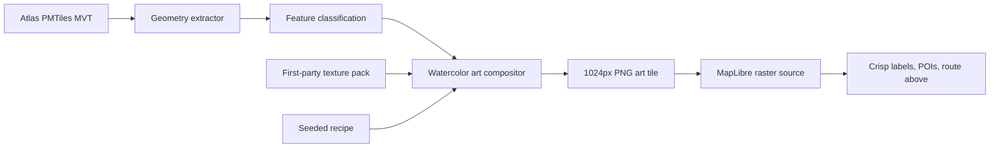

# RadMaps Watercolor Art Tile Plan

## Summary

Build RadMaps watercolor as a first-party, high-resolution art tile renderer.
The visible `radmaps-watercolor` preset should render one painted raster base
tile beneath crisp MapLibre labels, POIs, route layers, editor overlays, and
segment handles.

This plan supersedes the older CSS overlay, viewport blur, mask-first, and
hybrid vector-plus-texture watercolor attempts. Those approaches produced
blurred maps, vector-looking water, point-chain roads, and cluttered synthetic
texture. The current direction is a geometry-driven art compositor with
dedicated paint passes for paper, water, parks, roads, trails, junctions,
buildings, contours, stains, and sparse color events.

The near-term visual baseline is the local POC direction represented by:

- `v13b`: quieter paper, stronger road pigment, lower-saturation water.
- `v7`: joined 3-way and 4-way junction masks instead of stamped junction art.

These are visual references only. Production behavior must be implemented from
Atlas geometry and first-party texture assets.

## Product Goal

Watercolor should look like a print-quality scan of a painted cartographic
composition, not a blurred digital map. It should be:

- painterly but readable
- sparse enough for posters
- deterministic across editor, proof, and final print renders
- based on owned RadMaps Atlas data and first-party texture assets
- distinct from provider/Stadia/Stamen tiles, which should eventually leave the
  app entirely

Labels, POIs, and the GPX route core must remain crisp vector layers above the
painted base tile. A watercolor route underwash can be added later, but the
route core should not be baked into the base tile for V1.

## Non-Goals

- Do not use CSS filters, full-viewport blur, haze overlays, or terrain illusion
  overlays for watercolor.
- Do not bake text labels into watercolor tiles.
- Do not distort the GPX route core.
- Do not render ordinary vector water, parks, roads, trails, or waterways above
  the watercolor base except behind a debug flag.
- Do not copy, trace, or prompt for "Stamen style." Use first-party physical
  watercolor assets and RadMaps-specific recipes.
- Do not treat procedural texture placeholders as production-approved artwork.

## Architecture



The MapLibre style should use a single watercolor raster source/layer:

- source id: `radmaps-watercolor-base`
- protocol or URL: server-rendered watercolor tiles
- logical tile size: `512`
- encoded image size: `1024` for `scale=2`
- max source zoom: `14`
- overzoom behavior: editor zooms above `14` use z14 art tiles

The default path should be server-rendered PNG tiles. Browser-local rendering is
dev-only for recipe tuning and single-tile benchmarks.

## Tile Contract

Each watercolor tile is keyed by:

- `z/x/y`
- `scale`
- `rendererVersion`
- `texturePackVersion`
- `atlasArtifactId`
- `recipeId`
- `watercolor_seed`
- palette id or resolved palette values
- enabled layer set

Initial constants:

- `rendererVersion`: `watercolor-art-compositor-v5`
- `texturePackVersion`: `watercolor-asset-pack-v2-dev`
- `scale`: `2`
- output PNG: `1024x1024`
- displayed MapLibre tile: `512x512`
- Atlas maxzoom: `14`

`watercolor_seed?: string` remains the only persisted V1 style field.

## Source Geometry

Use the existing Atlas MVT base layers:

- `landcover`
- `landuse`
- `park`
- `water`
- `waterway`
- `building`
- `transportation`
- `transportation_name`
- `place`
- `poi`

Painted tiles may consume geometry from `water`, `waterway`, `park`,
`landcover`, `landuse`, `building`, and `transportation`. Label-only layers such
as `transportation_name`, `place`, and `poi` must never be baked into watercolor
tiles.

The geometry extractor should return:

- source layer
- feature id when available
- feature group
- properties
- tile-local pixel geometry
- world pixel geometry
- stable feature seed
- line/ring metrics such as length, bounding box, and node endpoints

Stable seeds should prefer feature identity. When that is missing, use a
quantized world-geometry hash. Do not seed visual variation from tile-local
`z/x/y` randomness.

## Paint Model

### 1. Paper

Land is paper, not broad watercolor wash.

Use first-party cold-press paper texture as the base:

- warm ivory tone
- subtle cotton fiber
- low-contrast aging
- sparse damp stains
- no cloudy procedural haze
- no repeated tile motif

Paper texture should be sampled in world pixel coordinates where possible so
adjacent tiles match without seams.

### 2. Water

Water needs its own wash renderer. It must not be a hard blue polygon fill plus
outline.

Required water passes:

- smooth filled wash mask
- gentle outside bleed beyond the shoreline
- interior pigment density variation
- granulation sampled from texture
- sparse interior blooms
- tide-ring/backrun marks
- restrained edge darkening

The current visual target is lower saturation than the first saturated pass, but
with visible pigment body and pooling. Missing ocean/coast water is an Atlas data
blocker, not something the client should invent from tile boundaries.

### 3. Parks

Parks should be quiet green watercolor washes, not opaque GIS polygons.

Required park passes:

- very light clipped wash
- soft edge irregularity
- subtle granulation
- restrained edge darkening

Parks should stay secondary to water, route, and roads.

### 4. Roads And Trails

Roads and trails should read as continuous hand-painted strokes, not point
blobs, separate stamps, or vector lines with blur.

Required road passes:

- continuous line mask from full feature geometry
- wet understroke
- pigment body clipped through a drybrush/pigment texture
- subtle dry edge deposits
- low center reserve or paper glint where useful
- width and opacity variation from continuous world-coordinate noise
- no visible line caps inside a tile for through-roads

Major roads, minor roads, trails, and waterways need separate recipes. Roads can
be more opaque than the surrounding paper and park washes, but should still show
paper texture through the pigment.

### 5. Joined Junctions

Junctions should be intentional paint events. They should not be stickers or
short art chunks placed on top of roads.

For each detected 3-way, 4-way, Y, route/road, trail/road, or waterway junction:

1. Build a local union mask from all connected stroke bodies.
2. Clip the junction effect to a local radius around the node.
3. Suppress the pale center reserve inside the junction radius.
4. Paint a shared pigment pool over the unioned body.
5. Add sparse overflow/backrun outside the road edge.
6. Pick the variant deterministically from the junction seed.

Variant families:

- joined 4-way pool
- feathered 3-way tee
- Y split/fork pool
- dry overlap
- repainted pass
- trail meet
- waterway join
- route/road underwash

The key lesson from the POCs: junction variants are mask operations, not stamped
images.

### 6. Waterways

Waterways should use the line renderer, but with water pigment:

- saturated enough to read as water
- mostly filled stroke body
- edge overflow and pooling
- restrained center glints
- joined masks at confluences

### 7. Buildings

Buildings are optional at supported zooms and should remain faint.

Treatment:

- thin jittered outline only
- no building fill
- no building wash
- no bloom

### 8. Contours

Contours should read as faint underdrawing or pencil linework:

- low opacity
- thin line
- no dominant watercolor color
- no heavy blur

### 9. Sparse Stains And Color Events

The background paper can have sparse color drops and water stains, but they must
remain tasteful and infrequent.

Rules:

- large, dispersed, low-alpha events
- deterministic world-grid or feature-adjacent placement
- favor water, parks, road junctions, and open paper
- avoid dense speckle fields
- avoid the "weathered quilt" look

## Texture Pack

Use the first-party dev texture pack as `watercolor-asset-pack-v2-dev` until
legal, print, and visual approval. Production should replace or augment the AI
dev pack with scanned or hand-painted RadMaps assets.

Required asset families:

- cold-press paper clean
- cold-press paper aged
- damp paper stains
- blue wash plates
- green wash plates
- umber wash plates
- rose wash plates
- neutral gray wash plates
- drybrush road strips
- thin trail/waterway strips
- boundary edge strips
- backrun/bloom masks
- granulation plates
- splash/drop masks
- pigment pool stamps
- pencil/contour underdrawing
- building outline strokes

Every texture asset should have recorded provenance:

- prompt or scan notes
- generation or scan date
- source file path
- checksum
- approved usage status

## Implementation Plan

### Phase 0: Preserve The Visual Baseline

Capture the current POC direction in docs and fixtures:

- v13b full tile: road opacity up, water saturation down, paper preserved
- v7 joined junction model: unioned 3-way and 4-way junction bodies

Create committed renderer fixtures instead of relying on `/tmp` files.

Deliverables:

- `docs/RADMAPS_WATERCOLOR_RENDERING_PLAN.md`
- fixture images under a committed or ignored visual fixture path
- notes for the accepted visual direction

### Phase 1: Core Art Tile Modules

Create runtime-agnostic modules under `utils/watercolor/`:

- `constants.ts`
- `types.ts`
- `seed.ts`
- `geometryExtractor.ts`
- `texturePack.ts`
- `textureSampler.ts`
- `paper.ts`
- `waterWash.ts`
- `paintedLines.ts`
- `junctions.ts`
- `parks.ts`
- `buildings.ts`
- `contours.ts`
- `splashes.ts`
- `artTileComposer.ts`

The compositor should produce raw RGBA pixels. Server code encodes PNG with
`sharp`. Browser-local dev mode may use `OffscreenCanvas`, but it is not the
shipping path.

### Phase 2: Real Atlas Geometry Tile

Render one real `1024x1024` art tile from Atlas MVT using the new modules.

First target:

- Mexico City current editor area

Then expand to:

- Driftless
- Chicago urban grid
- Seattle/Cascades
- Moab
- Yosemite/Rockies
- Acadia/coast
- water-heavy route

Acceptance:

- water is filled, not stroked
- roads are continuous
- junctions are joined
- no full-map blur
- no hard vector-looking water outline
- no route distortion

### Phase 3: Server Tile Endpoint

Add a server tile endpoint:

```text
/api/watercolor/tiles/base/{z}/{x}/{y}.png
```

Query/config inputs:

- `scale=2`
- recipe id
- seed
- palette
- enabled layer set
- atlas artifact id

The endpoint should:

- validate tile params
- clamp/overzoom above Atlas maxzoom 14
- fetch Atlas MVT from the same PMTiles lookup path used elsewhere
- extract geometry
- compose raw RGBA art tile
- encode PNG with `sharp`
- return hard errors for invalid params or render failures
- set cache headers appropriate for deterministic tile keys

### Phase 4: MapLibre Integration

Keep `watercolortile://` or route the visible preset to the server tile URL,
depending on the cleanest integration path. The visible `radmaps-watercolor`
preset should use only one raster base layer beneath crisp vector overlays.

MapLibre layer behavior:

- watercolor base below labels, POIs, route, route labels, handles, and editor UI
- no ordinary vector water/park/road/trail layers above the base
- debug vector layers allowed only behind a dev flag
- overzoom z14 art tiles above Atlas maxzoom 14

### Phase 5: Readiness And Error Tracking

Watercolor tiles must participate in render readiness.

`__RENDER_READY` should wait for:

- visible watercolor tile requests settled
- no hard watercolor tile errors
- MapLibre style loaded
- route source loaded
- labels and route layers ready

`window.__RADMAPS_RENDER_STATUS` should report a hard render error if any
required watercolor tile fails.

### Phase 6: Performance And Cache

Default cache limits:

- editor: 48 encoded tiles or 64 MB, concurrency 2
- print/render: 160 encoded tiles or 192 MB, concurrency 4

Do not cache decoded canvases or ImageBitmaps.

Performance gates:

- server-rendered 24x36 proof settles watercolor tiles within 15 seconds
- full AWS renderer proof/final render remains under the existing 60 second
  timeout
- dense Manhattan/Chicago tile benchmark recorded before production enablement

If server tile rendering is too slow, add a deterministic PNG tile cache by the
full watercolor tile key before enabling the preset broadly.

### Phase 7: Pre-Render Strategy

After V1 proves visually and operationally:

- Tier 1: exact premade/catalog map tile sets
- Tier 2: default recipe/seed/palette low zoom tiles
- Tier 3: on-demand server PNG cache by full watercolor tile key

This is not required for the first editor proof, but the renderer contract
should allow it.

## Tests

### Unit Tests

- deterministic output for identical tile keys
- no `Math.random()` affects pixels
- seed changes invalidate pixels
- renderer version changes invalidate pixels
- texture pack version changes invalidate pixels
- MVT extraction for all Atlas source layers
- label-only layers never enter painted tiles
- water fill pixels exist for water fixtures
- building treatment has outline pixels and no fill/wash alpha
- junction detector classifies 3-way, 4-way, Y, trail meet, and waterway join

### Mosaic And Seam Tests

Add 2x2 mosaic tests for:

- paper texture continuity
- water wash continuity
- crossing roads
- crossing waterways
- junctions near tile edges

Fail if:

- seam mean RGB delta is greater than `max(10, 2x adjacent internal-edge delta)`
- seam p95 exceeds `28`
- crossing-line fixtures have a stroke gap greater than `1.5px`

### Browser Tests

For the editor watercolor preset:

- tiles are nonblank
- water is filled
- roads are continuous
- labels remain crisp
- GPX route core remains crisp and undistorted
- panning and zooming request new watercolor tiles
- watercolor terrain/blur overlays are not active
- tile errors hard-fail render readiness

### Visual Fixtures

Maintain visual fixtures for:

- Mexico City
- Driftless
- Chicago urban grid
- Seattle/Cascades
- Moab
- Yosemite/Rockies
- Acadia/coast
- water-heavy route

Use these fixtures to compare recipe changes before tuning the live editor.

### Physical QA

Before production enablement, order or produce:

- one `24x36` sample
- one `32x48` sample

Evaluate:

- paper realism
- water depth
- road clarity
- label sharpness
- route clarity
- color saturation under real print conditions

## Rollout

1. Keep current watercolor work behind a dev/staff flag.
2. Add real Atlas tile POC endpoint.
3. Test Mexico City in the editor.
4. Add visual fixtures.
5. Enable staff-only preview.
6. Run AWS renderer proof tests.
7. Run physical QA.
8. Promote `radmaps-watercolor` only after visual, print, and performance gates
   pass.

## Documentation Updates

When implementation lands, update:

- `docs/RENDERING.md` for watercolor readiness and tile-error behavior
- `docs/MAP_TOOLS_CATALOG.md` for first-party watercolor tile source details
- `utils/mapToolCatalog.ts` for provider/catalog metadata
- Atlas docs if the renderer requires a specific Atlas artifact or geometry
  buffer

## Open Risks

- Real Atlas geometry may be denser and messier than the POC geometry.
- Coast/ocean water may be incomplete in Atlas data.
- Tile-edge seams may appear unless geometry buffer and world-coordinate texture
  sampling are correct.
- Warm paper and warm road colors are hard to separate with post-processing, so
  all real tuning should happen through geometry masks and paint recipes.
- AI-generated dev textures may not pass print/legal/visual approval.
- Server render time may require pre-rendered or cached watercolor PNG tiles.

## Immediate Next Step

Build the first real Atlas-backed `1024x1024` watercolor art tile from the
Mexico City editor area, using the v13b visual recipe and v7 joined-junction
model as the target.
