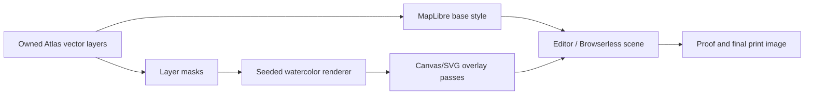

# RadMaps Watercolor Rendering Plan

## Goal

Create a believable, print-repeatable watercolor map style powered by owned
RadMaps Atlas vector data. The result should look like an intentionally painted
map, not a blurred vector style, and must reproduce deterministically in editor
previews, proof renders, and final Browserless print renders.

## Product Direction

Watercolor is a premium art treatment. It should be distinct from:

- `RadMaps Contour Wash`: pale blue contour-art style, not watercolor.
- `RadMaps Field/Atlas Topo`: functional topographic cartography.
- `RadMaps Toner`: graphic monochrome linework and dot texture.

The watercolor family should eventually include:

- `Watercolor Classic`: closest to the legacy provider watercolor feel.
- `Watercolor Wash`: wet pigment pools, softer land and hydro blooms.
- `Watercolor Paper`: dry paper grain, lighter pigment, less blur.
- `Watercolor Brush`: stronger hand-inked roads/rivers over translucent washes.

## Core Strategy

Do not try to make MapLibre paint properties alone simulate watercolor. Use
MapLibre and Atlas PMTiles for geography, then add a deterministic watercolor
renderer/compositor that derives masks from visible vector layers.

The system should render from the same data in:

- editor preview
- proof render
- final Browserless render
- style-browser visual fixtures

Same inputs plus same seed must produce the same final pixels.

## Rendering Architecture



## Inputs

The watercolor renderer should accept a stable recipe object:

```ts
interface WatercolorRenderRecipe {
  mapId: string
  styleVersion: string
  seed: string
  width: number
  height: number
  deviceScaleFactor: number
  palette: {
    paper: string
    land: string
    park: string
    water: string
    waterway: string
    road: string
    trail: string
    contour: string
    route: string
    ink: string
  }
  intensity: {
    paperGrain: number
    pigmentBloom: number
    edgeBleed: number
    granulation: number
    strokeWobble: number
    lineBreakup: number
  }
  enabledLayers: {
    landcover: boolean
    park: boolean
    water: boolean
    waterway: boolean
    transportation: boolean
    contour: boolean
  }
}
```

## Technique Stack

### 1. Paper Foundation

Add a seeded paper grain pass before the map layer:

- low-frequency fiber texture
- subtle warm/cool pigment variation
- no obvious square tiling
- deterministic seed based on `map.id`, `atlas_style_id`, and render size

Editor can use a lower-resolution cached texture. Final print should render at
the final CSS/device scale so texture is crisp enough for 24x36 and 32x48.

### 2. Vector Layer Masks

Use Atlas layers as masks:

- `landcover`: broad wash base
- `park`: green pigment bloom and soft edges
- `water`: blue pigment pools and shoreline blooms
- `waterway`: brushed wet line with edge bleed
- `transportation`: dry brush/ink linework
- `contour`: faint pencil/pigment contour lines

The first implementation can approximate masks using MapLibre layer duplication
and blend modes. The production-grade implementation should support offscreen
canvas masks for deterministic compositing.

### 3. Pigment Washes

Render multiple transparent passes per filled layer:

- base fill at low opacity
- offset wash pass
- noise-modulated pigment density
- edge bloom pass
- slight mask expansion/erosion for organic borders

Avoid whole-map blur. Blur should apply only to pigment bloom passes.

### 4. Brushed Lines

Roads, trails, rivers, and route art need line-specific treatment:

- jittered or wobble-sampled line geometry
- broken alpha texture along the stroke
- dry-brush side gaps
- softer underwash below a sharper ink stroke
- capped blur so print remains crisp

Route line should stay readable and above basemap linework, but can get a subtle
painted edge in watercolor presets.

### 5. Labels

Labels should remain legible:

- keep type mostly crisp
- use soft paper-colored halos
- route collision layer should keep labels away from the route when possible
- no watercolor distortion on text

### 6. Print Reproducibility

Final render must be deterministic:

- seeded PRNG, no `Math.random()`
- recipe version included in render hash
- no time-based noise
- no external raster effects that can change between renders
- same browser path for editor/proof/final, with higher quality settings for final

## Implementation Phases

### Phase 1: Watercolor Overlay v1

Create a shared module:

- `utils/watercolorRenderer.ts`
- deterministic seeded noise helpers
- paper grain canvas generation
- CSS/canvas overlay component in `MapPreview.vue`
- style config fields for watercolor intensity and seed

Acceptance:

- editor and Browserless render both show the same watercolor paper base
- no visible square tiling at normal editor zoom
- final render waits for overlay readiness before `__RENDER_READY`

### Phase 2: Masked Pigment Passes

Add vector-derived pigment layers:

- water pigment pool
- shoreline bloom
- park/land wash
- waterway wet stroke
- contour pigment line treatment

Acceptance:

- water and rivers look painted, not simply vector blue
- land/park areas blend rather than appearing as hard polygons
- overlays scale cleanly in 24x36 proof/final tests

### Phase 3: Brushed Transportation And Route Treatment

Add linework effects:

- dry-brush road underlay
- trail broken stroke option
- route underwash plus crisp route core
- independent major/minor/trail controls still work

Acceptance:

- roads/rivers/trails look hand-rendered enough to justify the style name
- route remains clear over all watercolor variants
- labels remain above route where feasible

### Phase 4: Print QA Matrix

Run sample renders across:

- Yosemite
- Rockies
- Smokies
- North Shore
- Driftless
- Chicago
- Moab
- Seattle/Cascades
- Acadia

Sizes:

- `8x12`
- `24x36`
- `32x48`

Acceptance:

- no blurry full-map haze
- no repeating texture squares
- no illegible labels
- route is readable
- contours preserve enough density
- final Browserless renders complete inside timeout

## Tests

Unit tests:

- seeded renderer returns stable values
- recipe hash changes when watercolor parameters change
- default watercolor recipes do not enable whole-map blur
- route wash/casing layers remain below labels
- Atlas watercolor presets continue to use owned `radmaps-atlas-base`

Integration tests:

- `MapPreview.vue` marks watercolor overlay ready before render readiness
- switching Atlas watercolor presets rebuilds/replays latest style config
- Browserless fixture renders deterministic screenshots for same seed

Visual tests:

- style-browser matrix for watercolor variants
- compare provider watercolor reference against owned watercolor attempts
- print-size fixtures at 24x36 and 32x48

## Open Questions

- Whether masks should be generated entirely in-browser from rendered vector
  layers or precomputed per viewport in an offscreen canvas helper.
- Whether p5.js style techniques are useful as implementation inspiration, or
  whether we should keep the final implementation in direct Canvas/WebGL helpers
  for smaller dependencies and tighter render control.
- Whether route-specific watercolor treatment should be a per-style default or a
  user-facing toggle.
- Whether final print should increase watercolor sample count based on print size.

## Near-Term Next Step

Build `Watercolor Overlay v1` as a deterministic paper and pigment texture layer
behind labels and above/below selected Atlas layers. Keep `Contour Wash` separate
as a preserved quick theme, and do not rename it watercolor unless it receives
the full pigment/brush treatment.
