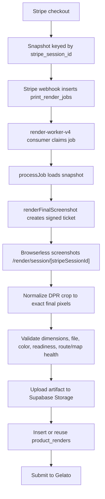

# Render Worker v4 — Browserless Screenshot Handoff

**Project:** RadMaps `render-worker-v4`
**Status date:** 2026-05-04
**Audience:** engineers and agents maintaining the final print render path.

This file describes the current queue worker after the renderer course
correction: RadMaps captures the real Nuxt/Vue/MapLibre poster in Chromium
through Browserless. The old Puppeteer worker and alternate native/SVG spike
have been removed.

For the complete renderer and print-size guide, read
[docs/RENDERING.md](/Users/anthonymaro/Documents/apps/trailmaps/trailmaps-app/docs/RENDERING.md).

---

## TL;DR

- `MapPreview.vue` is the only poster renderer.
- Browserless screenshots `/render/map/[id]` for proofs and `/render/session/[stripeSessionId]` for final order renders.
- Nuxt owns proof rendering; `render-worker-v4` owns final queued render orchestration.
- The worker is not a separate poster renderer; it calls Browserless and handles queue/validation/upload/Gelato submission.
- Final jobs remain queued in Postgres so Browserless concurrency is bounded.
- Print geometry comes from `utils/print/printFraming.ts`; provider/product details come from `utils/print/providerProfile.ts`.
- Sellable product sizes are locked to 2:3: `8x12`, `12x18`, `16x24`, `20x30`, `24x36`, `32x48`.
- `24x36` final with 3 mm bleed renders to about `7271x10871` pixels.
- `32x48` is capped at 200 DPI.

---

## Why The Direction Changed

The removed alternate-renderer plan aimed to avoid Chromium instability, but it
recreated the poster outside the editor. That brought back the exact drift
problem RadMaps needed to eliminate: editor output and final print output could
look different.

The active plan favors parity:

1. The user styles the poster in `MapPreview.vue`.
2. Proofs screenshot that same component.
3. Final paid renders screenshot that same component at print dimensions.
4. The worker validates and ships the exact raster artifact.

This means DOM text is rasterized, but at 300 DPI that is acceptable for launch
pending physical samples. If typography artifacts show up in samples, capture
PNG first or investigate PDF support, but do not silently reintroduce a second
poster renderer.

---

## Repository Orientation

Important app-side files:

- `components/map/MapPreview.vue` — canonical poster renderer and readiness owner.
- `pages/render/map/[id].vue` — proof render page.
- `pages/render/session/[stripeSessionId].vue` — final render page.
- `server/api/render/payload.get.ts` — validates signed ticket and returns server-approved render payload.
- `server/api/maps/[id]/render.post.ts` — proof render API route.
- `server/utils/screenshotService.ts` — Nuxt-side Browserless screenshot helper.
- `server/utils/snapshot.ts` — immutable checkout/order snapshot writer.
- `utils/render/renderTicket.ts` — signed short-lived render tickets.
- `utils/render/hash.ts` and `utils/render/hashVersion.ts` — render hash inputs and version pins.
- `utils/print/printFraming.ts` — bleed, trim, safe, proof/final DPI, pixel dimensions.
- `utils/print/providerProfile.ts` — Gelato profiles, max DPI, size aliases, product UID normalization.
- `utils/products.ts` — visible product catalog.

Important worker-side files:

- `render-worker-v4/src/queue/consumer.ts` — Postgres queue polling and job claiming.
- `render-worker-v4/src/queue/processJob.ts` — per-job orchestration.
- `render-worker-v4/src/queue/renderFinalScreenshot.ts` — final Browserless screenshot implementation.
- `render-worker-v4/src/queue/normalizeFinalScreenshot.ts` — DPR rounding crop back to exact provider pixels.
- `render-worker-v4/src/queue/validateBrowserScreenshot.ts` — final artifact validation.
- `render-worker-v4/src/browserless.ts` — worker-side Browserless client.
- `render-worker-v4/src/storage.ts` — Supabase Storage uploads.
- `render-worker-v4/src/queue/gelato.ts` — Gelato submission.
- `render-worker-v4/src/config.ts` — env parsing.

The worker intentionally has no HTTP render endpoint, alternate poster renderer,
tile cache, or legacy Puppeteer fallback.

---

## Final Queue Flow



The render page never reads service-role data in browser code. It receives a
signed ticket, calls `/api/render/payload`, and gets only the map/snapshot data
authorized by that ticket.

---

## Readiness Contract

Browserless must wait for app readiness:

```js
window.__RENDER_READY === true && !window.__RADMAPS_RENDER_STATUS?.errors?.length
```

The readiness signal must only flip after:

- MapLibre style is loaded,
- route source/layers are populated,
- style reloads are settled,
- tiles are loaded or intentionally absent,
- fonts are ready,
- logos/images are loaded or explicitly disabled,
- overlays and labels have rendered,
- the page has recorded no internal render errors.

Fixed sleeps, `networkidle`, or selector-only waits are insufficient. They can
capture missing tiles, fallback fonts, blank canvases, or half-rendered overlays.

---

## Print Size Contract

The editor is fixed to one 2:3 aspect ratio. Product size changes should not
change the route framing. Mixed-aspect products are not allowed until the editor
has explicit aspect-family support.

Supported final sizes:

| Size | DPI | Notes |
|---|---:|---|
| `8x12` | 300 | standard 2:3 |
| `12x18` | 300 | standard 2:3 |
| `16x24` | 300 | standard 2:3 |
| `20x30` | 300 | canvas/digital only in current catalog |
| `24x36` | 300 | default |
| `32x48` | 200 | large-format cap |

Legacy aliases:

- `8x10` maps to `8x12`
- `11x14` maps to `12x18`
- `16x20` maps to `16x24`
- `18x24` maps to `24x36`

The aliases exist for old database rows and stale requests; do not expose them
as new product choices.

---

## Pixel Geometry

Always call `getPrintFraming(productUid, renderClass)`.

Do not derive dimensions from `recommended_px_w`, product labels, string splits,
or hard-coded tables in worker code.

Important behavior:

- proof DPI is lower than final DPI,
- final DPI starts at 300 and is clamped by `profile.maxDpi`,
- output includes bleed,
- safe and trim boxes are computed from provider profile values,
- `mapViewportPx` equals the full bleed canvas.

Odd dimensions are expected. Example: `24x36` plus 3 mm bleed at 300 DPI is
approximately `7271x10871`. Final renders use a half-size CSS viewport with
`deviceScaleFactor: 2` to keep large Browserless captures under the current
60 second timeout cap. The worker then crops any one-pixel DPR rounding surplus
from the right/bottom edge before validation and upload. Never validate or
upload the raw Browserless buffer for final prints.

---

## Environment

Required worker variables:

```bash
SUPABASE_URL=...
SUPABASE_SERVICE_KEY=...
DATABASE_URL=...
GELATO_API_KEY=...
GELATO_ORDER_TYPE=draft

BROWSERLESS_TOKEN=...
BROWSERLESS_ENDPOINT=https://production-sfo.browserless.io
BROWSERLESS_TIMEOUT_MS=60000
RENDER_TICKET_SECRET=...
APP_URL=https://radmaps.studio
```

For local E2E, prefer running from the repo root:

```bash
npm run print-worker:dev
```

That launcher merges root `.env` with optional `render-worker-v4/.env`
overrides and sets `APP_URL` from `NUXT_PUBLIC_SITE_URL`. Standalone Railway
deployments still need the worker service variables configured directly.

Use `GELATO_ORDER_TYPE=draft` for faux orders. Gelato draft orders validate and
appear in the dashboard without going into production until converted.

`RENDER_TICKET_SECRET` must match the Nuxt app. Generate with:

```bash
openssl rand -hex 32
```

For local Browserless testing, expose the Nuxt dev server with ngrok and point
`APP_URL`/`NUXT_PUBLIC_SITE_URL` at that public URL. If Vite blocks the ngrok
hostname, add it to the Vite/Nuxt allowed-host configuration.

---

## Validation

The worker should block final fulfillment when validation finds a real render
failure. Required checks:

- image dimensions exactly equal `getPrintFraming(productUid, 'final')`,
- JPEG/PNG decodes successfully,
- image is not empty or trivially tiny,
- file size is below the provider cap,
- color space is acceptable sRGB,
- render page reports no readiness errors,
- map canvas is not blank,
- route pixels exist or the render page explicitly confirms route source/layers rendered,
- fonts and requested logos/images loaded.

Validation should produce useful diagnostics for manual review. Avoid noisy
false positives that block healthy renders.

---

## Concurrency And Operations

Browserless can scale, but final print screenshots are expensive. Keep final
renders behind `print_render_jobs`; tune worker concurrency to the Browserless
plan and observed render times.

Operational rules:

- do not render paid-order final artifacts directly inside a Vercel request,
- proof renders need rate limiting before broad public launch,
- queue workers should retry transient Browserless, tile, and upload failures,
- jobs that exhaust retries should move to manual review,
- stuck `rendering` jobs need stale-claim recovery,
- monitor Browserless timeout rate, render duration, validation failure rate, and Gelato submission failures.

Hundreds of concurrent users are acceptable if the expensive screenshot stage is
bounded. Hundreds of simultaneous final 24x36 screenshots should queue.

---

## How To Run Locally

App tests:

```bash
npm run test -- --run tests/print-framing.test.ts tests/render-hash.test.ts tests/useSavedThemes.test.ts
npm run build
```

Worker tests/build:

```bash
cd render-worker-v4
npm test
npm run build
```

Local Browserless smoke test shape:

1. Start Nuxt locally.
2. Expose the Nuxt port through ngrok.
3. Set `NUXT_PUBLIC_SITE_URL` and worker `APP_URL` to the ngrok URL.
4. Use a map with known route data.
5. Trigger a proof render or insert a final test job.
6. Confirm dimensions, file size, visual content, and readiness diagnostics.

Full checkout E2E shape:

1. Use Stripe `sk_test_...` and `pk_test_...` keys.
2. Run `stripe listen --forward-to localhost:3001/api/orders/webhook` and copy the printed `whsec_...` into `.env`.
3. Set `DATABASE_URL`, Browserless vars, `RENDER_TICKET_SECRET`, `GELATO_API_KEY`, and `GELATO_ORDER_TYPE=draft`.
4. Run `npm run e2e:readiness`.
5. Run `npm run print-worker:dev`.
6. Pay in Checkout with Stripe test card `4242 4242 4242 4242`.

For Google font-heavy tests through ngrok, prefer a bot User-Agent approach over
the `ngrok-skip-browser-warning` request header. The header can trigger CORS
preflight behavior that breaks font loading.

---

## Updating Sizes Or Aspect Ratio

For size-only changes within 2:3:

1. Verify the Gelato product UID and template.
2. Update `types/index.ts`.
3. Update `utils/products.ts`.
4. Update `utils/print/providerProfile.ts`.
5. Update tests that assert framing or hashes.
6. Render smallest/default/largest acceptance samples.
7. Order physical samples before production sales.

For aspect-ratio changes:

- treat it as a product project,
- add explicit editor aspect state,
- update `MapPreview.vue` editor and print behavior,
- update frozen camera math, overlays, text overlays, logos, thumbnails, checkout, proof rendering, and final rendering,
- stop overloading `print_size` as the only shape indicator if multiple aspect families are allowed,
- update hash versions so stale 2:3 artifacts cannot be reused,
- build visual regression fixtures per aspect family,
- order physical samples per aspect/material.

Until then, keep sellable products at 2:3.

---

## Known Risks

- Physical sample prints are still required before relying on this for all production orders.
- Proof rendering still needs abuse/rate limiting.
- Browserless timeout behavior should be monitored under real load.
- Logo and future uploaded image sources must remain whitelisted or copied into trusted storage.
- Typecheck currently has broader repo issues outside this renderer handoff; keep renderer tests and builds green while those are cleaned up.

---

## Current Status Card

```text
Renderer architecture    : Browserless screenshot of real Nuxt poster
Canonical poster source  : components/map/MapPreview.vue
Proof path               : Nuxt API route -> Browserless -> Supabase Storage
Final path               : print_render_jobs -> render-worker-v4 -> Browserless -> Gelato
Aspect policy            : fixed 2:3 editor and products
Default final size       : 24x36 at 300 DPI plus bleed
Largest final size       : 32x48 at 200 DPI plus bleed
Primary docs             : docs/RENDERING.md, AGENTS.md, CLAUDE.md, README.md
Next hardening           : rate limiting, queue tuning, physical samples, visual matrix
```
